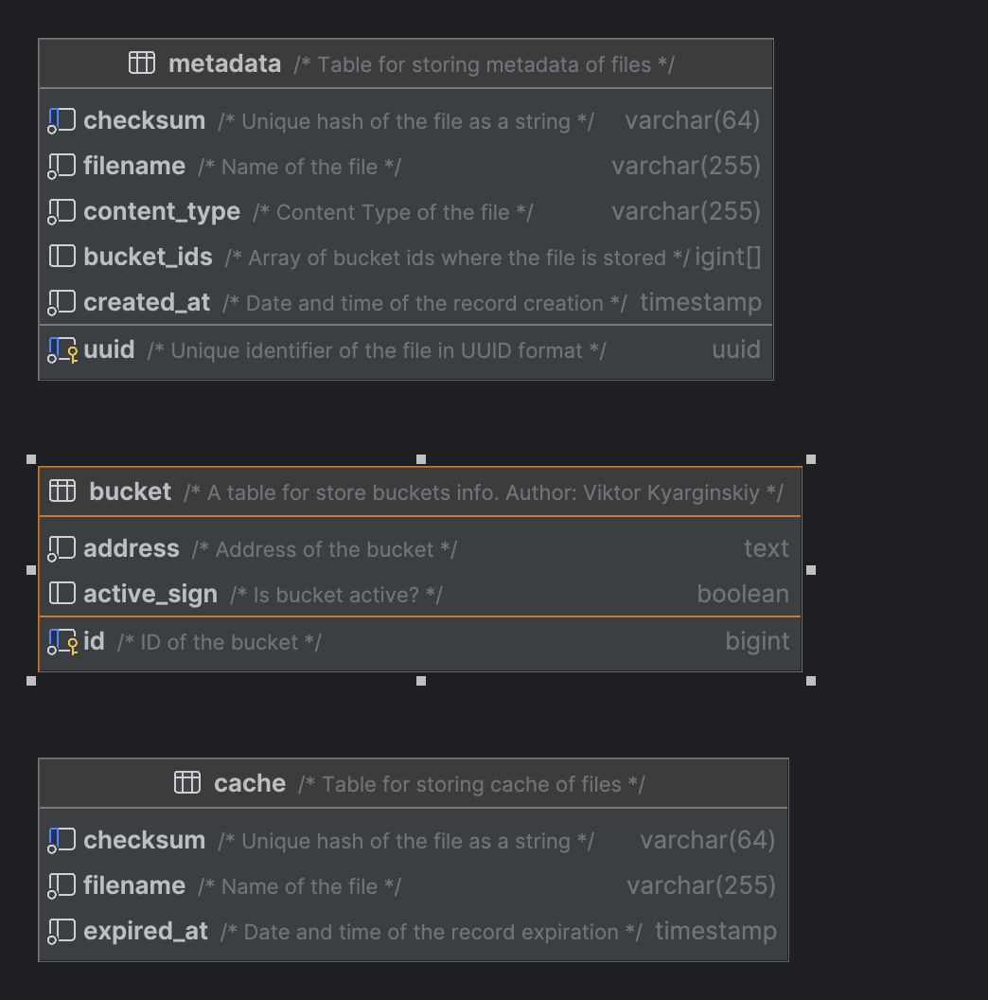

Golang Developer Test Cases
====

Вы решили создать конкурента Amazon S3 и знаете как сделать лучший сервис хранения файлов.

На сервер A по REST присылают файл, его надо разрезать на 6 примерно равных частей и сохранить на серверах хранения Bn (n ≥ 6).

При REST-запросе на сервер A нужно достать куски с серверов Bn склеить их и отдать файл.

# Имеем следующее
1. Один сервер для REST запросов
2. Несколько серверов для хранения кусков файлов

# Ограничения
1. Реализовать сервис и тестовый модуль, который обеспечит проверку его работы
2. Сервера для хранения могут добавляться в систему в любой момент, но не могут удаляться из системы
3. Предусмотреть равномерное заполнение серверов хранения
4. Код разместить в Github

# System schemes


# Схема базы данных



# Соображения по архитектуре

## Реализация

Реализуем 2 приложения:
- service_a
- service_b

## Запуск service_a

```shell
export SERVICE_A_CONFIG_PATH=config/service_a/prod.yaml && go run ./cmd/service_a
```

## Запуск service_b

Нужно запустить несколько экземпляров service_b со своим портом, например:

```shell
export SERVICE_B_REDIS_DB=1 && export SERVICE_B_PORT=8261 && export SERVICE_B_CONFIG_PATH=config/service_b/local.yaml && go run ./cmd/service_b
```
```shell
export SERVICE_B_REDIS_DB=2 && export SERVICE_B_PORT=8262 && export SERVICE_B_CONFIG_PATH=config/service_b/local.yaml && go run ./cmd/service_b
```
```shell
export SERVICE_B_REDIS_DB=3 && export SERVICE_B_PORT=8263 && export SERVICE_B_CONFIG_PATH=config/service_b/local.yaml && go run ./cmd/service_b
```

## Запуск сервисов через docker containers

```shell
docker-compose up -d
```

## Останов сервисов в docker containers

```shell
docker-compose down
```

# Как тестировать с использованием Postman

### запрос на сохранение файла
```shell
PUT http://localhost:8260/api/file
```
тело запроса

- form-data

  - key: file
  - value: <выбранный файл>

Ответ

код 200 OK

тело ответа - id сохранённого файла
```json
{
    "id": "fe1f3f07-8eb3-11ee-829b-0242ac130006"
}
```

### запрос на получение файла
```shell
GET http://localhost:8260/api/file/{id}
```
где
id = fe1f3f07-8eb3-11ee-829b-0242ac130006

результат - содержимое файла.

Лучше всего тестировать на графических файлах (*.jpg, *.png etc.) так как на них хорошо видно соблюдение целостности файла при загрузке из частей.


# Добавляем новый сервер для хранения (bucket)

1) добавляем описание нового сервера в конфигурацию service_a
```sql
INSERT INTO bucket (id, address, active_sign) VALUES
    (7, 'http://host.docker.internal:8267', true);
``` 
2) запускаем новый экземпляр service_b
```shell
export SERVICE_B_REDIS_DB=7 && export SERVICE_B_PORT=8267 && export SERVICE_B_CONFIG_PATH=config/service_b/local.yaml && go run ./cmd/service_b
```

3) перезапускаем service_a

4) проверяем, что новый сервер участвует в сохранении файлов

```
-----------------
|   bucket_ids  |
-----------------
|{1,2,3,4,5,6,7}|
-----------------
```

## Подключение OpenTelemetry

https://www.jaegertracing.io/docs/1.47/getting-started/

Запуск
```
docker run -d --name jaeger \
  -e COLLECTOR_ZIPKIN_HOST_PORT=:9411 \
  -e COLLECTOR_OTLP_ENABLED=true \
  -p 6831:6831/udp \
  -p 6832:6832/udp \
  -p 5778:5778 \
  -p 16686:16686 \
  -p 4317:4317 \
  -p 4318:4318 \
  -p 14250:14250 \
  -p 14268:14268 \
  -p 14269:14269 \
  -p 9411:9411 \
  jaegertracing/all-in-one:1.51

```

Просмотр

http://localhost:16686 to access the Jaeger UI.


В заголовок добавляем request-id запроса

```
request-id=fe1f3f07-8eb3-11ee-829b-0242ac130006
```

```
go get -u go.opentelemetry.io/otel
go get -u go.opentelemetry.io/contrib/instrumentation/net/http/otelhttp

```

# Что ещё можно сделать

- более детальную обработку ошибок
- сделать удаление файлов с серверов хранения при удалении с сервера A
- сейчас кэш сделан в виде хранения файлов и очистка кэша сделана по таймеру; можно сделать другой механизм очистки кэша (например, по количеству файлов в кэше, LRU etc.) 
- вынести кэш в отдельный сервис (если хотим горизонтально масштабировать сервис A)
- сделать отдельный сервис управления бакетами (создание, удаление, список)
- ~~функциональные тесты с использованием testcontainer (postgres, redis)~~
- ~~добавить трассировку запросов через сервисы с использованием OpenTelemetry~~


Jaeger

https://www.inanzzz.com/index.php/post/4qes/implementing-opentelemetry-and-jaeger-tracing-in-golang-http-api
https://github.com/albertteoh/jaeger-go-example/blob/main/lib/tracing/init.go

### Добавили сжатие файла с UPX

```shell  
upx --best service_a
upx --ultra-brute --no-lzma service_a
upx --ultra-brute --lzma service_a
```

| Параметер | Result    | Origin    | Ratio |
|---------|-----------|-----------|-------|
| --best  | 3 833 872 | 8 582 610 |   44.67%    |
| --ultra-brute --no-lzma  | 3 833 872 | 8 582 610 |  44.67%   |
| --ultra-brute --lzma  | 2 408 464 | 8 582 610 |  28.06%   |


#### Обратная связь по тестовому заданию от Karma8

```text
ОС по тестовому заданию:

Кандидат ввел понятия serviceA, serviceB по сути аналоги front и chunk server. Далее front и chunk
1. Upload 
1.1 Используеться http mutipart upload, вычитываем body полностью в оперативку. 
От кандидата ни в readme ни в коде нет никакого комментария(менять это либо нет).
1.2. Пишем файл в os в имя ./cache/ID 
1.2. Тело и ID(string) файла передаються в метод сервиса загрузки. ID получаем их хедеров загрузки. 
Далее описание происходящего в сервисе:
1.2.1. Получаем cache path пример ./cache/ID (префикс константа)
1.2.2  Открываем файл на диске читаем его и делаем hash  с помощью sha256.
1.2.3  Получаем список чанк серверов(для чанков) - всегда ОДИН И ТОТ ЖЕ.
1.2.4  Пишем в базу метаданные - пустой uuid, checksum,filename,content-type,список чанк серверов(кандидат их называет бакетами).
1.2.5 Сохраняем метаданные в кеш. checksum,fileName,expiredAt(now+3min). Кеш - это база постгрес. 
1.2.6   Рассылка файла по чанк серверам
1.2.6.1 Опять получаем список чанк серверов(бакетов). Файл разрезается не на 6 частей а на ВСЕ чанк сервера.
1.2.6.2 Читаем файл с диска с помощью seek(хотя весь файл есть в оперативке еще). 
1.2.6.3 Формируем чанки. Все в памяти. 
        По формированию есть 2 ошибки.
        1. Если fileSize не делится на partsCount - разбитие происходит неверно.
        
        2. Для формирование чанка используется 
        file.Seek(offset, 0), 
        partData := make([]byte, partSize)
        n, err := file.Read(partData)
        Source: partData[:n] - кандидат не знает что Read без гарантии заполнит fileData.
        Кадидат написал тесты но кейс 1 не предусмотрел (пример нерабочего теста) ниже       
1.2.6.4 Пишем чанки асинхронно в разные чанк сервера. Пишем тем же мультипат аплоадом. 
Из важного - кандидат практически нигде не использует контекст.
1.2.6.5 Чанк сервер со своей стороны принимает чанк, пишет его в РЕДИС. Да именно в редис(счас уже не ошибся).:-)

Бэкграунд процесс- clear cache бегает удаляет с бд записи и удаляет файлики.


2. Download.
2.1 Получаем в запросе uuid.  
2.2 Проверяем файлик в кеше, если нет то берем с серверов.
(предусмотрение того что файлик может быть прибит clear cacheм во время чтение из кеша - НЕТ).
2.3 Получаем все чанки в горутинах.
    Есть вот такой кусок кода(используеться для логирования), может крашнутся если чанк меньше 10 байт. 
       var res string
 if len(results[s.buckets[i].ID]) > 0 {
  res = string(results[s.buckets[i].ID][:10]) + "..."
 }
    Все в память читается.
2.4. Все чанки соединяются в один большой слайс байт.

В целом. По коду - читаем, есть комменты, используются интерфейсы. 
Написан красивый readme. 
Не в readme  не в в коде нет комментов по поводу того что все в памяти. 
Чанк сервер пишет в редис. 


По тестовому:
 Предусмотреть равномерное заполнение серверов хранения - это не сделано. 
 Все пишется первый чанк в первый сервер, второй чанк во второй сервер....
 Разрезание и склеивание - размер файлика должен делиться на количество серверов, а иначе сервис файлик сохранит не полностью.

func TestSplitFile1(t *testing.T) {
 name := "name"
 payload := "somedata"
 err := os.WriteFile(name, []byte(payload), os.ModePerm)
 require.NoError(t, err)

 parts, err := SplitFile(name, []int64{1, 2, 3})
 require.NoError(t, err)

 actualData := ""
 for _, part := range parts {
  actualData += string(part.Source)
 }
 
 fmt.Println(actualData) //-return someda
}
```